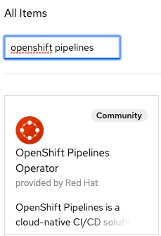
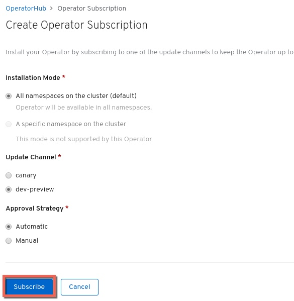
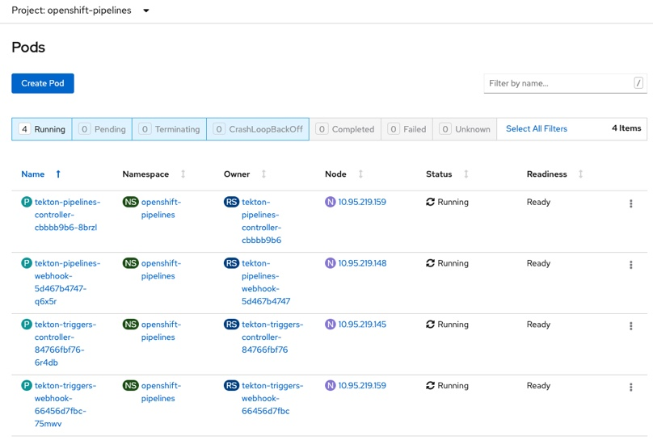

Installing OpenShift Pipelines (Tekton) in OCP 4.3
---
## Introduction
Openshift Container Platform (OCP) 4.3 has started the transition from Jenkins to Tekton as the foundation for OpenShift Pipelines. This document covers the installation and configuration of the OpenShift Pipelines operator in OCP 4.3

## Installation of the OpenShift Pipelines Operation in OCP 4.3

- In the OCP UI (as a Cluster-Administrator) click **Operators --> OperatorHub**

- In the search box enter `Openshift Pipelines`

  

- Select the **OpenShift Pipelines Operator**

- Click **Continue** and then click **Install**

  

- Leave the default installation mode (all namespaces) and click **Subscribe**

  

- Wait a few moments for the Operator to finish installing

  

- Validate that the `openshift-pipelines` namespace has pods for `tekton-pipelines` and `tekton-triggers` and that they are running

  

## Conclusion
You've now installed the Red Hat provided OpenShift Pipelines Operator.
