# CloudPak for Applications: Runtime Modernization Solution

## Introduction
**Runtime modernization** moves an application to a 'built for the cloud' runtime with the least amount of effort. **WebSphere Liberty** is a fast, dynamic, and easy-to-use Java application server, built on the open source Open Liberty project. Ideal or the cloud, Liberty is a combination of IBM technology and open source software, with fast startup times (<2 seconds), no server restarts to pick up changes, and a simple XML configuration.

However, WebSphere Liberty doesn't support all of the legacy Java EE and WebSphere proprietary functionality and some code changes maybe required to move an existing application to the new runtime. Effort is also required to move the application configuration from traditional WebSphere to WebSphere Liberty's XML configuration files.

**This path gets the application on to a cloud-ready runtime container which is easy to use and portable. However, the application is mostly unchanged and has not been 'modernized' to a newer architecture such as micro-services**  

Applications deployed on the WebSphere Liberty container runtime can be build, deployed and managed with the same common technologies and methodologies that would be used by cloud-native (built for the cloud) applications.

  The diagram below shows the high level decision flow where IBM Cloud Transformation Advisor is used to analyze existing assets and a decision is made to move the monolithic application to the Liberty container.

  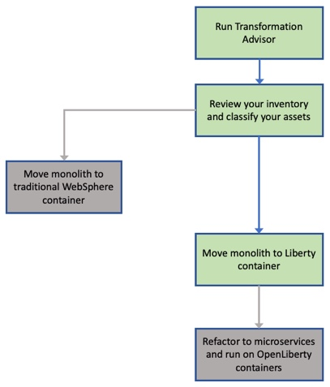

This repository holds a solution that is the result of a **runtime modernization** for an existing WebSphere Java EE application that was moved from WebSphere ND v8.5.5 to WebSphere Liberty and deployed by the IBM CloudPak for Applications to Red Hat OpenShift.

## Table of Contents

- [Application Overview](#application-overview)
- [How the Application was Modernized](#how-the-application-was-modernized)
  - [Analysis](#analysis)
  - [Build](#build)
- [Deploy the Application using OpenShift Pipelines](#deploy-the-application-using-openshift-pipelines)
- [Deploy the Application using OpenShift Pipelines and ArgoCD](#deploy-the-application-using-openshift-pipelines-and-argocd)
- [Validate the Application](#validate-the-application-on-4x)
- [Summary](#summary)

## Application Overview
The **Customer Order Services** application is a simple store-front shopping application, built during the early days of the Web 2.0 movement. Users interact directly with a browser-based interface and manage their cart to submit orders.  This application is built using the traditional [3-Tier Architecture](http://www.tonymarston.net/php-mysql/3-tier-architecture.html) model, with an HTTP server, an application server, and a supporting database.


There are several components of the overall application architecture:
- Starting with the database, the application leverages two SQL-based databases running on [IBM DB2](https://www.ibm.com/analytics/us/en/technology/db2/).
- The application exposes its data model through an [Enterprise JavaBean](https://en.wikipedia.org/wiki/Enterprise_JavaBeans) layer, named **CustomerOrderServices**.  This components leverages the [Java Persistence API](https://en.wikibooks.org/wiki/Java_Persistence/What_is_JPA%3F) to exposed the backend data model to calling services with minimal coding effort.
  - This build of the application uses JavaEE6 features for EJBs and JPA.
- The next tier of the application, named **CustomerOrderServicesWeb**, exposes the necessary business APIs via REST-based web services.  This component leverages the [JAX-RS](https://en.wikipedia.org/wiki/Java_API_for_RESTful_Web_Services) libraries for creating Java-based REST services with minimal coding effort.
  - This build of the application is using **JAX-RS 1.1** version of the respective capability.
- The application's user interface is exposed through the **CustomerOrderServicesWeb** component as well, in the form of a [Dojo Toolkit](#tbd)-based JavaScript application.  Delivering the user interface and business APIs in the same component is one major inhibitor our migration strategy will help to alleviate in the long-term.
- Finally, there is an additional integration testing component, named **CustomerOrderServicesTest** that is built to quickly validate an application's build and deployment to a given application server.  This test component contains both **JPA** and **JAX-RS**-based tests.

## How the Application was Modernized
In order to modernize the application from WebSphere ND v8.5.5 to WebSphere Liberty running on OpenShift, the application went through **analysis**, **build** and **deploy** phases.

### Analysis
[IBM Cloud Transformation Advisor](https://www.ibm.com/cloud/garage/practices/learn/ibm-transformation-advisor) was used to analyze the existing Customer Order Services application and the WebSphere ND runtime. The steps were:

1. Install IBM Cloud Transformation Advisor either in to a [Kubernetes Cluster](https://developer.ibm.com/recipes/tutorials/deploying-transformation-advisor-into-ibm-cloud-private/) or [locally](https://www.ibm.com/cloud/garage/tutorials/install-ibm-transformation-advisor-local)

2. Download and execute the **Data Collector** against the existing WebSphere ND runtime

3. Upload the results of the data collection in to IBM Cloud Transformation Advisor and review the analysis. A screenshot of the analysis is shown below:

  

  In the case of the **CustomerOrderServicesApp.ear** application, IBM Cloud Transformation Advisor has determined that the migration to WebSphere Liberty on Private Cloud is of **Moderate** complexity and that there are two **Severe Issues** that have been detected.

4. Drilling down in to **Detailed Migration Analysis Report** that is part of the application analysis, it is apparent that IBM Cloud Transformation Advisor has detected that there are issues with lookups for Enterprise JavaBeans and with accessing the Apache Wink APIs.

  

  **Behavior change on lookups for Enterprise JavaBeans** In Liberty, EJB components are not bound to a server root Java Naming and Directory Interface (JNDI) namespace as they are in WebSphere Application Server traditional. The fix for this is to change the three classes that use `ejblocal` to use the correct URL for Liberty

  **The user of system provided Apache Wink APIs requires configuration** To use system-provided third-party APIs in Liberty applications, you must configure the applications to include the APIs. In WebSphere Application Server traditional, these APIs are available without configuration. This is a configuration only change and can be achieved by using a `classloader` definition in the Liberty server.xml file.

5. In summary, some minimal code changes are required to move this application to the WebSphere Liberty runtime and the decision was taken to proceed with these code changes.

Detailed, step-by-step instructions on how to replicate these steps are provided [here](liberty-analyze.md)

### Build
The **build** phase made changes to source code and created the WebSphere Liberty configuration artifacts. The steps were:

1. Make the simple code changes required for the EJB lookups which were recommended by IBM Cloud Transformation Advisor. The three Java classes that should be modified to look up Enterprise JavaBeans differently are shown in the detailed analysis view of IBM Cloud Transformation Advisor:

  

  Below is an example of the code changes required for one of the three Java classes. The `org.pwte.example.resources.CategoryResource.java` is changed from using `ejblocal` on line 28 as shown below:

  Before:

  ```java
  ...
  InitialContext().lookup("ejblocal:org.pwte.example.service.ProductSearchService");
  ...
  ```

  After:

  ```java
  ...
  InitialContext().lookup("java:app/CustomerOrderServices/ProductSearchServiceImpl!org.pwte.example.service.ProductSearchService");
  ...
  ```

2. The WebSphere Liberty runtime configuration files `server.xml`, `server.env` and `jvm.options` were created from the templates provided by IBM Cloud Transformation Advisor. The final versions of files can be found here:

- [server.xml](https://github.com/ibm-cloud-architecture/appmod-liberty-jenkins/blob/master/liberty/server.xml)
- [server.env](https://github.com/ibm-cloud-architecture/appmod-liberty-jenkins/blob/master/liberty/server.env)
- [jvm.options](https://github.com/ibm-cloud-architecture/appmod-liberty-jenkins/blob/master/liberty/jvm.options)

3. WebSphere Liberty was configured for application monitoring using Prometheus and the Prometheus JMX Exporter. This was necessary to integrate WebSphere Liberty with the Red Hat OpenShift monitoring framework.

4. The `Dockerfile` required to build the **immutable Docker Image** containing the application and WebSphere Liberty was created from the template provided by IBM Cloud Transformation Advisor. The final file can be found here:

- [Dockerfile](https://github.com/ibm-cloud-architecture/appmod-liberty-jenkins/blob/master/Dockerfile)

5. The containerized application was tested locally before the code and configuration files were committed to the **git** repository

Detailed, step-by-step instructions on how to replicate these steps are provided [here](liberty-build.md)

## Deploy the Application using OpenShift Pipelines
The following steps will deploy the modernized Customer Order Services application in a WebSphere Liberty container to a Red Hat OpenShift cluster using **OpenShift Pipelines**. An alternative is to use **ArgoCD** for deployment. Click here to see the [Deploy the Application using OpenShift Pipelines and ArgoCD](#deploy-the-application-using-openshift-pipelines-and-argocd) option

The diagram below shows the following flow:

1) A developer commits code to the `application repository`
2) A webhook starts a `tekton pipeline` running in the `build` project
3) A `tekton task` clones the application source code (4) from the application repository, uses `Maven` to compile and test the application before using `buildah` to create a `Docker image` which is pushed to the docker registry (5)
6) A `tekton task` deploys the `application` to the local namespace using the image from the `docker registry` (7)

  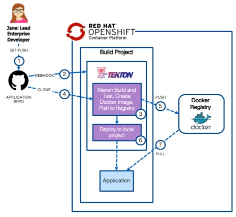

### Prerequisites
You will need the following:

- [Git CLI](https://git-scm.com/book/en/v2/Getting-Started-Installing-Git)
- Red Hat OpenShift Container Platfrom 4.3 with Cluster Admin permissions
- [oc CLI](https://docs.openshift.com/container-platform/3.11/cli_reference/get_started_cli.html)
- DB2 Database
- Red Hat OpenShift Pipelines **ADD A LINK TO INSTALL**
- Tekton CLI **ADD A LINK TO INSTALL**

### Getting the project repository
You can clone the repository from its main GitHub repository page and checkout the appropriate branch for this version of the application.

```
git clone https://github.com/ibm-cloud-architecture/appmod-liberty-tekton.git
cd appmod-liberty-tekton
```

### Create application database infrastructure
As said in the prerequisites section above, the Customer Order Services application uses uses DB2 as its database. Follow these steps to create the appropriate database, tables and data the application needs to:

1. Copy the createOrderDB.sql and initialDataSet.sql files you can find in the Common directory of this repository over to the db2 host machine (or git clone the repository) in order to execute them later.

2. ssh into the db2 host

3. Change to the db2 instance user: `su {database_instance_name}``

4. Start db2: `db2start`

4. Create the ORDERDB database: `db2 create database ORDERDB`

5. Connect to the ORDERDB database: `db2 connect to ORDERDB`

6. Execute the createOrderDB.sql script you copied over in step 1 in order to create the appropriate tables, relationships, primary keys, etc: `db2 -tf createOrderDB.sql`

7. Execute the initialDataSet.sql script you copied over in step 1 to populate the ORDERDB database with the needed initial data set: `db2 -tf initialDataSet.sql`

If you want to re-run the scripts, please make sure you drop the databases and create them again.

### Create the Security Context Constraint
In order to deploy and run the WebSphere Liberty Docker image in an OpenShift cluster, we first need to configure certain security aspects for the cluster. The `Security Context Constraint` provided [here](https://github.com/ibm-cloud-architecture/appmod-liberty-jenkins/blob/master/Deployment/OpenShift/ssc.yaml) grants the [service account](https://kubernetes.io/docs/tasks/configure-pod-container/configure-service-account/) that the WebSphere Liberty Docker container is running under the required privileges to function correctly.

A **cluster administrator** can use the file provided [here](https://github.com/ibm-cloud-architecture/appmod-liberty-jenkins/blob/master/Deployment/OpenShift/ssc.yaml) with the following command to create the Security Context Constraint (SCC):

```
cd Deployment/OpenShift
oc apply -f ssc.yaml
```

### Create the build project
Create the project that will be used for the Tekton pipeline and the initial deployment of the application.

Issue the command shown below to create the project:
```
oc new-project cos-liberty-tekton
```

### Create a service account
It is a good Kubernetes practice to create a [service account](https://kubernetes.io/docs/tasks/configure-pod-container/configure-service-account/) for your applications. A service account provides an identity for processes that run in a Pod. In this step we will create a new service account with the name `websphere` and add the Security Context Constraint created above to it.

Issue the commands shown below to create the `websphere` service account and bind the ibm-websphere-scc to it in each of the projects:
```
oc create serviceaccount websphere -n cos-liberty-tekton
oc adm policy add-scc-to-user ibm-websphere-scc -z websphere -n cos-liberty-tekton
```

### Import the Tekton resources
Import the Tekton `Tasks`, `Pipeline` and `PipelineResources` in to the project using the commands shown below:

```
cd ../../tekton/tekton-only
oc apply -f gse-apply-manifests-pvc-task.yaml
oc apply -f gse-buildah-pvc-task.yaml
oc apply -f gse-build-deploy-pvc-pipeline.yaml
oc apply -f gse-build-pipeline-resources.yaml
```

### Run the pipeline
The recommended way to trigger the pipeline would be via a webhook (**link**) but for simplicity the command line can be used. Issue the command below to trigger the pipeline:

```
tkn pipeline start  gse-build-deploy-pvc-pipeline -n cos-liberty-tekton
```

When prompted, accept the default `git-source` value as shown below:

  

When prompted, accept the default `docker-image` value as shown below:

  

### View the pipeline logs
1. In the OpenShift Container Platform UI, change to the **Developer** view, select the `cos-liberty-tekton` project and then select **Pipelines**. Click on the **Last Run**

  

2. Select **Logs**

  

3. The pipeline will execute and the logs will be displayed

  

4. Once both the `gse-build` and `gse-apply-manifests` steps are complete, the pipeline is finished.

### Validate the application
Now that the pipeline is complete, validate the Customer Order Services application is deployed and running in `cos-liberty-tekton` project

1. In the OpenShift Console, navigate to **Topology** view and click on the `cos-liberty` DeploymentConfig to view deployment details, including `Pods` `Services` and `Routes`

#### Topology
  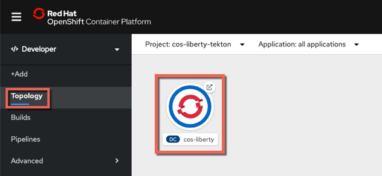

2. From this view you can also view the **route** for the application. Note that the URL is < application_name >-< project_name >.< ocp cluster url >. In this case the project name is `cos-liberty-tekton`

  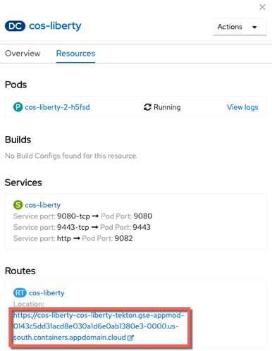

4. Add `/CustomerOrderServicesWeb` to the end of the URL in the browser to access the application

  

5. Log in to the application with `username: rbarcia` and `password: bl0wfish`

## Deploy the Application using OpenShift Pipelines and ArgoCD
The following steps will deploy the modernized Customer Order Services application in a WebSphere Liberty container to a Red Hat OpenShift cluster using **OpenShift Pipelines** and **ArgoCD**.

The diagram below shows the following flow:

1) A developer commits code to the `application repository`
2) A webhook starts a `tekton pipeline` running in the `build` project
3) A `tekton task` clones the application source code (4) from the application repository, uses `Maven` to compile and test the application before using `buildah` to create a `Docker image` which is pushed to the docker registry (5)
6) A `tekton task` deploys the `application` to the local namespace using the image from the `docker registry` (7)
8) A `tekton task` updates the `gitops repository` with the `docker image tag` for the newly created docker image and commits the change (9)
10) ArgoCD is used to `synchronize` the changes from the gitops repository with the `dev` namespace
11) The application running in the `dev` namespace is updated with the latest docker image from the registry

  

### Prerequisites
You will need the following:

- [Git CLI](https://git-scm.com/book/en/v2/Getting-Started-Installing-Git)
- Red Hat OpenShift Container Platfrom 4.3 with Cluster Admin permissions
- [oc CLI](https://docs.openshift.com/container-platform/3.11/cli_reference/get_started_cli.html)
- DB2 Database
- Red Hat OpenShift Pipelines **ADD A LINK TO INSTALL**
- Tekton CLI **ADD A LINK TO INSTALL**
- ArgoCD **ADD A LINK TO INSTALL**
- argocd CLI **ADD A LINK TO INSTALL**

### Fork the appmod-gitops repository
Fork the [appmod-gitops](https://github.com/ibm-cloud-architecture/appmod-gitops) GitHub repository in to your own github.com account

1. Navigate to the [appmod-gitops](https://github.com/ibm-cloud-architecture/appmod-gitops) GitHub repository

2. Click **Fork**

  

3. Select the **Target** and wait for the fork process to complete

### Create a github access token
You will need to grant ArgoCD access to make changes to the newly forked Github repository

1. Click on your GitHub.com account dropdown in the top right corner and select **Settings**

2. Select **Developer settings** from the menu and then select **Personal Access Tokens**

3. Click **Generate new token**

  

4. Enter a `name` for the token in the `Note` field and select the `repo` scope as shown below. No other scopes are required. Click **Generate token**

  

5. **Copy** the token and **keep** it for a later step. This is the only time the token will be visible to you.

  

### Getting the project repository
You can clone the repository from its main GitHub repository page and checkout the appropriate branch for this version of the application.

```
git clone https://github.com/ibm-cloud-architecture/appmod-liberty-tekton.git
cd appmod-liberty-tekton
```

### Create application database infrastructure
As said in the prerequisites section above, the Customer Order Services application uses uses DB2 as its database. Follow these steps to create the appropriate database, tables and data the application needs to:

1. Copy the createOrderDB.sql and initialDataSet.sql files you can find in the Common directory of this repository over to the db2 host machine (or git clone the repository) in order to execute them later.

2. ssh into the db2 host

3. Change to the db2 instance user: `su {database_instance_name}``

4. Start db2: `db2start`

4. Create the ORDERDB database: `db2 create database ORDERDB`

5. Connect to the ORDERDB database: `db2 connect to ORDERDB`

6. Execute the createOrderDB.sql script you copied over in step 1 in order to create the appropriate tables, relationships, primary keys, etc: `db2 -tf createOrderDB.sql`

7. Execute the initialDataSet.sql script you copied over in step 1 to populate the ORDERDB database with the needed initial data set: `db2 -tf initialDataSet.sql`

If you want to re-run the scripts, please make sure you drop the databases and create them again.

### Create the Security Context Constraint
In order to deploy and run the WebSphere Liberty Docker image in an OpenShift cluster, we first need to configure certain security aspects for the cluster. The `Security Context Constraint` provided [here](https://github.com/ibm-cloud-architecture/appmod-liberty-jenkins/blob/master/Deployment/OpenShift/ssc.yaml) grants the [service account](https://kubernetes.io/docs/tasks/configure-pod-container/configure-service-account/) that the WebSphere Liberty Docker container is running under the required privileges to function correctly.

A **cluster administrator** can use the file provided [here](https://github.com/ibm-cloud-architecture/appmod-liberty-jenkins/blob/master/Deployment/OpenShift/ssc.yaml) with the following command to create the Security Context Constraint (SCC):

```
cd Deployment/OpenShift
oc apply -f ssc.yaml
```

### Create the build project
Create the project that will be used for the Tekton pipeline and the initial deployment of the application.

Issue the command shown below to create the project:
```
oc new-project cos-liberty-tekton
```

### Create a secret for your github access token
Edit the `tekton/tekton-argo/appmod-github-secret.yaml` file and set your `username` (to your github.com username) and `password` (to your **access token** created earlier)

```
apiVersion: v1
kind: Secret
metadata:
  name: dm-github
  annotations:
    tekton.dev/git-0: https://github.com # Described below
type: kubernetes.io/basic-auth
stringData:
  username: xxxxx  
  password: xxxxx
```

Execute the commands below to create the secret and bind it to the service account that Tekton will be using to execute the Tasks.

```
cd tekton/tekton-argo
oc apply -f appmod-github-secret.yaml
oc patch serviceaccount pipeline -p '{"secrets": [{"name": "appmod-github"}]}'
```

### Create a service account
It is a good Kubernetes practice to create a [service account](https://kubernetes.io/docs/tasks/configure-pod-container/configure-service-account/) for your applications. A service account provides an identity for processes that run in a Pod. In this step we will create a new service account with the name `websphere` and add the Security Context Constraint created above to it.

Issue the commands shown below to create the `websphere` service account and bind the ibm-websphere-scc to it in each of the projects:
```
oc create serviceaccount websphere -n cos-liberty-tekton
oc adm policy add-scc-to-user ibm-websphere-scc -z websphere -n cos-liberty-tekton
```

### Import the Tekton resources
Import the Tekton `Tasks`, `Pipeline` and `PipelineResources` in to the project using the commands shown below:

```
oc apply -f gse-apply-manifests-pvc-task.yaml
oc apply -f gse-gitops-pvc-task.yaml
oc apply -f gse-buildah-pvc-task.yaml
oc apply -f gse-build-gitops-pvc-pipeline.yaml
oc apply -f gse-build-pipeline-resources.yaml
```

### Create the dev project
Create the project that will be used for the `development` version of the application that will be deployed by `ArgoCD`.

Issue the command shown below to create the project:
```
oc new-project cos-liberty-dev
```

### Create a service account
Create a `websphere` service account in the new project using the commands below:
```
oc create serviceaccount websphere -n cos-liberty-dev
oc adm policy add-scc-to-user ibm-websphere-scc -z websphere -n cos-liberty-dev
```

### Update the service account
In order to `pull` the image that is created by the pipeline (which is in the `cos-liberty-tekton` namespace) a `role` must be added to the service account using the command shown below:
```
oc policy add-role-to-group system:image-puller system:serviceaccounts:cos-liberty-dev --namespace=cos-liberty-tekton
```

### Update the argocd service account
Use the command below to grant the `argocd-application-controller` access to the `cos-liberty-dev` namespace to make changes:
```
oc policy add-role-to-user edit system:serviceaccount:argocd:argocd-application-controller -n cos-liberty-dev
```

### Configure ArgoCD
In this step you will import a defintion of the cos-liberty application in to ArgoCD

1. Log in to ArgoCD using the CLI as the admin user.
```
argocd login --insecure <url of your argocd server>
```

2. Edit the `tekton/tekton-argo/argo-project.yaml` file and set your `repoURL` (to the URL of your forked repository from earlier)
```
apiVersion: argoproj.io/v1alpha1
kind: Application
metadata:
  name: cos-liberty
  namespace: argocd
spec:
  project: default
  source:
    repoURL: https://github.com/davemulley/test-gitops
    path: cos-liberty/dev
    targetRevision: HEAD
    directory:
      recurse: true
      jsonnet: {}
  destination:
    server: https://kubernetes.default.svc
    namespace: cos-liberty-dev
```

3. Execute the following command to create the application definition in ArgoCD
```
argocd app create cos-liberty -f argo-project.yaml
```

4. Log in to the ArgoCD UI as the `admin` user and validate that the application is shown on the **Applications** view

  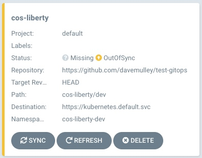


## Run the pipeline
The recommended way to trigger the pipeline would be via a webhook (**link**) but for simplicity the command line can be used. Issue the command below (replace the `GITOPS_REPO` value with the URL of your forked repository from earlier) to trigger the pipeline and accept the default values for `source` and `image`

```
tkn pipeline start  gse-build-gitops-pvc-pipeline -p GITOPS_REPO="https://github.com/davemulley/test-gitops.git" -n cos-liberty-tekton
```

When prompted, accept the default `git-source` value as shown below:

  

When prompted, accept the default `docker-image` value as shown below:

  

### View the pipeline logs
1. In the OpenShift Container Platform UI, change to the **Developer** view, select the `cos-liberty-tekton` project and then select **Pipelines**. Click on the **Last Run**

  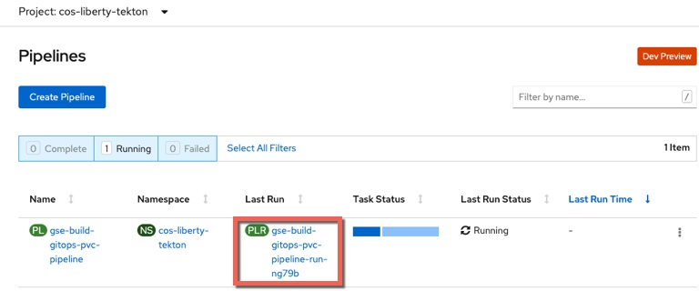

2. Select **Logs**

  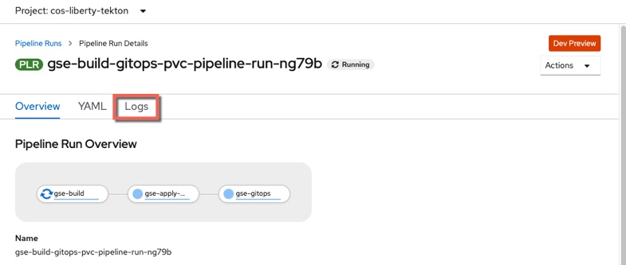

3. The pipeline will execute and the logs will be displayed

  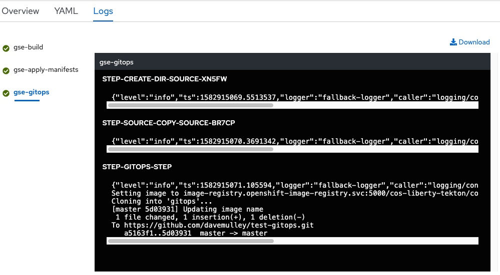

4. Once both the `gse-build`, `gse-apply-manifests` and `gse-gitops` steps are complete, the pipeline is finished.

### Validate the application in the pipeline namespace
Now that the pipeline is complete, validate the Customer Order Services application is deployed and running in `cos-liberty-tekton` project

1. In the OpenShift Console, navigate to **Topology** view and click on the `cos-liberty` DeploymentConfig to view deployment details, including `Pods` `Services` and `Routes`

#### Topology
  

2. From this view you can also view the **route** for the application. Note that the URL is < application_name >-< project_name >.< ocp cluster url >. In this case the project name is `cos-liberty-tekton`

  

4. Add `/CustomerOrderServicesWeb` to the end of the URL in the browser to access the application

  

5. Log in to the application with `username: rbarcia` and `password: bl0wfish`

### Trigger the ArgoCD synchronization of the dev namespace
1. In the ArgoCD UI, navigate to the **applications** view and click **SYNC** on the `cos-liberty` application

  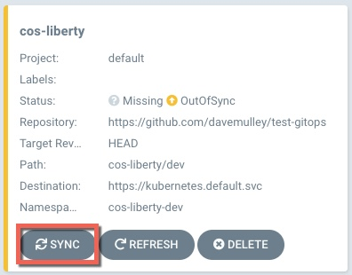

2. On the panel that is displayed, click **SYNCHRONIZE** to synchronize all of the artifacts in to the `cos-liberty-dev` namespace

  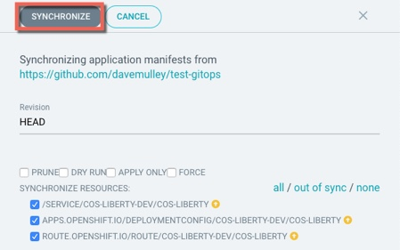

3. Note that the **Status** is quickly shown as **Healthy, Synced**

  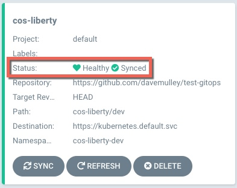

4. Click on the **cos-liberty** application to drill-down to the more detailed view and note that the `deploymentconfig`, `service` and `route` have been created. Watch the application pod on the right be deployed and after a short while show as running

  

### Validate the application in the dev namespace
1. In the OpenShift Console, navigate to the **cos-liberty-dev** project

2. Now navigate to the **Topology** view and click on the `cos-liberty` DeploymentConfig to view deployment details, including `Pods` `Services` and `Routes`

#### Topology
  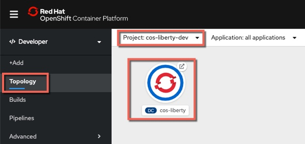

3. From this view you can also view the **route** for the application. Note that the URL is < application_name >-< project_name >.< ocp cluster url >. In this case the project name is `cos-liberty-dev`

  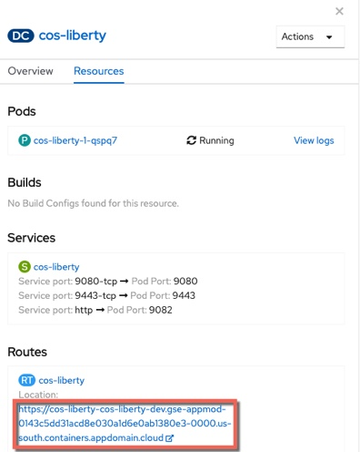

4. Add `/CustomerOrderServicesWeb` to the end of the URL in the browser to access the application

  

5. Log in to the application with `username: rbarcia` and `password: bl0wfish`

## Summary
This application has been modified from the initial [WebSphere ND v8.5.5 version](https://github.com/ibm-cloud-architecture/cloudpak-for-applications/tree/was855) to run on WebSphere Liberty and deployed by the IBM CloudPak for Applications.
